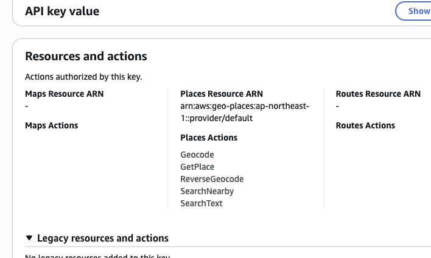

# Amazon Location Service Geocoder MCP

<div><video controls src="./doc/demo.mov" muted="false"></video></div>

## Getting Started

### API Key

*AWS Management Console*

- API key is required.
- following scopes are required:
  - `Geocode`
  - `SearchNearby`

### MCP Server Configuration

`claude_desktop_config.json`

```json
{
 "mcpServers": {
  "geocoder": {
   "command": "npx",
   "args": ["aws-geocode-mcp"],
   "env": {
    "AMAZON_LOCATION_API_KEY": "YOUR_API_KEY", // required
    "AWS_REGION": "us-east-1" // optional, default is ap-northeast-1
   }
  }
 }
}
```
